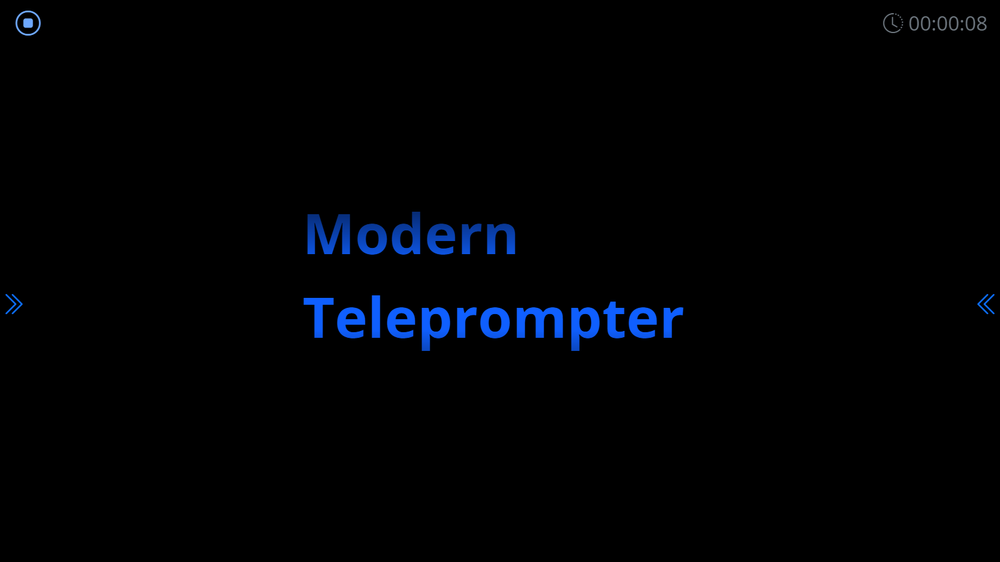

# Modern Teleprompter #

A feature packed modern Teleprompter, with everything you need to read the text from a screen or teleprompter.

Feel free to check-out the features below or try out a free online version.

## Screenshots ##

## Features ##

- [X] Edit text in the browser or send it remotely to any device
- [X] Full mobile phone and tablet support
- [X] Mirror ready - Flip X, Y or both axis
- [X] Customize text legibility (color, bold, size)
- [X] Countdown timer before teleprompter starts
- [X] Handy keyboard shortcuts
- [X] Go full screen automatically
- [X] Remote control settings and text separately
- [X] Changes saved automatically

## Keyboard Shortcuts ##

Key              | Alternatives                            | Description
:---------------:|:---------------------------------------:|:--------------------------
<kbd>SPACE</kbd> | <kbd>P</kbd>                            | Start / Stop Teleprompter
<kbd>←</kbd>     |                                         | Slow Down Teleprompter
<kbd>→</kbd>     |                                         | Speed Up Teleprompter
<kbd>↑</kbd>     |                                         | Scroll Teleprompter Down
<kbd>↓</kbd>     |                                         | Scroll Teleprompter Up
<kbd>G</kbd>     |                                         | Increase Font Size
<kbd>F</kbd>     |                                         | Decrease Font Size
<kbd>E</kbd>     |                                         | Increase Teleprompter Width
<kbd>W</kbd>     |                                         | Decrease Teleprompter Width
<kbd>ESC</kbd>   |                                         | Exit full screen / Stop Teleprompter
<kbd>X</kbd>     |                                         | Flip X Axis
<kbd>Y</kbd>     |                                         | Flip Y Axis
<kbd>M</kbd>     |                                         | Move Cue Indicator Up
<kbd>N</kbd>     |                                         | Move Cue Indicator Down
<kbd>L</kbd>     |                                         | Download Text From Server

# Updates and changes #

## Version 1.1 ##

- **New:** Remote control functionality
- **Updated:** Increased the range of speeds
- **Fixes:** Mobile devices count down sometimes glitched

## Version 1.0 ##

- **New:** Full redesign of UI
- **New:** Countdown before the teleprompter starts
- **New:** Ability to make the text bold
- **New:** Lock text editing to remove accidental changes, especially on mobile devices 
- **New:** New look with new icons
- **New:** Grouping of settings for easier 
- **New:** When editor focused, automatically disable X,Y mirroring so you can easier edit it
- **New:** Go full screen when teleprompter starts
- **New:** New application icon
- **Updated:** Improved mobile device experience with easier to set sliders
- **Updated:** Bigger ranges of font sizes
- **Updated:** Bigger range of scroll speeds
- **Updated:** Bigger range for cue indicator
- **Fixes:** Scroll direction on X, Y axis change
- **Fixes:** On paste remove all formating so the text looks the same

## Version 0.5 ##

- **New:** Option to change the width of the prompter text
- **New:** Option to move the cue indicator up and down.
- **New:** Ability to jump ahead with key arrows. Move text up and down during the playback.
- **Updated:** Shortcuts for all elements with hint on mouse over.
- **Updated:** Speed increments
- **Fixes:** Typos

