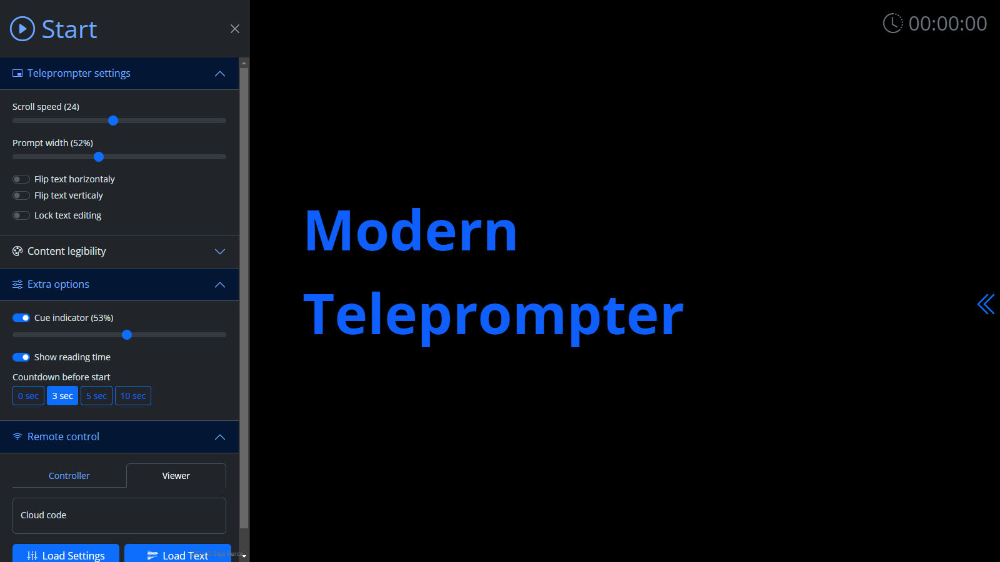

# Modern Teleprompter #

A feature packed modern Teleprompter, with everything you need to read the text from a screen or teleprompter.

Feel free to check-out the features below or try out a free online version.

If you or your company enjoy using this project, please consider supporting me. 💖

## Screenshots ##

## Features ##

- [X] Voice control with 100 supported languages
- [X] Edit text in the browser or send it remotely to any device
- [X] Full mobile phone and tablet support
- [X] Mirror ready - Flip X, Y or both axis
- [X] Customize text legibility (color, bold, size)
- [X] Countdown timer before teleprompter starts
- [X] Handy keyboard shortcuts
- [X] Go full screen automatically
- [X] Remote control settings and text separately
- [X] Changes saved automatically

## Keyboard Shortcuts ##

Key              | Alternatives                            | Description
:---------------:|:---------------------------------------:|:--------------------------
<kbd>P</kbd>     |                                         | Start / Stop Teleprompter
<kbd>SPACE</kbd> | <kbd>B</kbd> <kbd>F5</kbd> <kbd>.</kbd> | Pause / Un-Pause Teleprompter
<kbd>ESC</kbd>   |                                         | Stop Teleprompter / Exit full screen
<kbd>←</kbd>     | <kbd>PAGE UP</kbd>                      | Slow Down Teleprompter
<kbd>→</kbd>     | <kbd>PAGE DOWN</kbd>                    | Speed Up Teleprompter
<kbd>↑</kbd>     |                                         | Scroll Teleprompter Down
<kbd>↓</kbd>     |                                         | Scroll Teleprompter Up
<kbd>G</kbd>     |                                         | Increase Font Size
<kbd>F</kbd>     |                                         | Decrease Font Size
<kbd>E</kbd>     |                                         | Increase Teleprompter Width
<kbd>W</kbd>     |                                         | Decrease Teleprompter Width
<kbd>X</kbd>     |                                         | Flip X Axis
<kbd>Y</kbd>     |                                         | Flip Y Axis
<kbd>M</kbd>     |                                         | Move Cue Indicator Up
<kbd>N</kbd>     |                                         | Move Cue Indicator Down
<kbd>L</kbd>     |                                         | Download Text From Server

